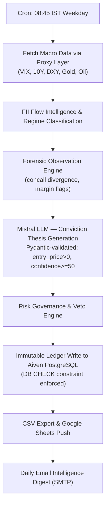

<div align="center">

# Sovereign Alpha: Institutional NLP Data-as-a-Service

**Autonomous Indian Equities Intelligence Engine — B2B Data Distribution**

*Identify variant perception. Quantify hidden risk. Capture non-consensus alpha.*

[](https://python.org)
[](https://github.com/features/actions)
[](https://docs.google.com/spreadsheets)
[](https://aiven.io)

</div>

## Overview

Sovereign Alpha is a **headless Data-as-a-Service (DaaS)** intelligence engine for **Quantitative Finance** and **Algorithmic Trading**.  
It runs fully autonomously via GitHub Actions, fetching live market data, generating NLP-driven institutional theses, and distributing structured outputs to B2B clients via **Google Sheets** and **daily email digests** — with zero human intervention.

> **Operational Phase**: Passive B2B data distribution via automated CSV/Google Sheets outputs.  
> The engine is in live operation. No dashboard or frontend is required.

---

## Autonomous Execution Flow (GitHub Actions)

The pipeline triggers every weekday at **08:45 IST (03:15 UTC)** via `.github/workflows/daily-pipeline.yml`:



**If any step in B → G fails, the pipeline exits with code 1 and GitHub Actions marks the run RED.**  
No partial or corrupted data is allowed to proceed downstream.

---

## Fail-Fast Error Handling Philosophy

Sovereign Alpha enforces a **strict fail-fast architecture**. There are no soft fallbacks, no silent defaults, and no fabricated data.

| Layer | Enforcement |
|---|---|
| **HTTP Data Fetches** | `_proxied_get()` raises `ConnectionError` on non-200 or network failure |
| **LLM Output** | `pydantic.Field(gt=0)` on all prices; `min_length=10` on thesis; raises `ValueError` on bad output |
| **Application Logic** | Core steps (`market_data`, `regime`, `predictions`, `ledger`) raise `RuntimeError` on failure — no soft continue |
| **DB Insert** | `psycopg2.errors.CheckViolation` caught explicitly; pipeline exits 1 with full traceback |
| **Email Script** | `sys.exit(1)` on crash — never `sys.exit(0)` |
| **Veto Archive** | `_save_veto()` raises `RuntimeError` instead of returning `False` |

---

## Proxy Layer

To bypass cloud IP blocks on external financial data APIs (NSE, World Bank, SEC EDGAR), all outbound HTTP requests in `engine/data_layer.py` are routed through a configurable proxy.

**Set the following GitHub Repository Secret:**

```
PROXY_API_KEY=<your_scraperapi_or_brightdata_api_key>
```

When `PROXY_API_KEY` is set, all requests in `DataLayer._proxied_get()` are routed through:

```
https://api.scraperapi.com/?api_key=<KEY>&url=<encoded_target_url>
```

If `PROXY_API_KEY` is not set, direct requests are used (suitable for local development).  
**A failed proxy request raises `ConnectionError` immediately — the pipeline does not retry silently.**

---

## Database Schema Constraints (Aiven PostgreSQL)

The `prediction_ledger` table has database-level `CHECK` constraints enforced at the SQL layer — these cannot be bypassed by application code or LLM hallucinations:

| Constraint | Rule | Purpose |
|---|---|---|
| `chk_confidence_score_minimum` | `confidence_score >= 50` | Rejects sub-50 LLM outputs |
| `chk_entry_price_positive` | `entry_price IS NULL OR entry_price > 0` | Prevents zero-price corruption |
| `chk_target_price_positive` | `target_price IS NULL OR target_price > 0` | Prevents zero-target corruption |
| `chk_stop_loss_positive` | `stop_loss IS NULL OR stop_loss > 0` | Prevents zero-stop corruption |

**To apply constraints to a fresh database:**

```bash
psql $DATABASE_URL -f db_constraints.sql
```

When the DB rejects a row due to a `CheckViolation`, the pipeline logs the exact constraint name and prediction ID, then immediately exits with code 1.

---

## B2B Data Distribution

### Google Sheets (Live Push)

Subscribers receive structured data under the **Daily Intelligence** tab:

| Section | Contents |
|---|---|
| **Header** | Run timestamp (IST) and system status |
| **Macro Regime** | Regime classification, confidence, key drivers |
| **Today's Predictions** | Asset, sector, confidence %, status, thesis |
| **Today's Observations** | Timestamp, ticker, severity, headline |

### CSV Exports

Automated CSV outputs are written to `exports/` each run for direct B2B data distribution:
- `autopsy_matches.csv` — historical bulk deal trap matches
- `bulk_deal_universe.csv` — top 100 institutional mid/small-cap tickers

### Daily Email Digest

Dispatched each morning via SMTP. Contains the full edge verification scorecard, regime classification, top predictions, and forensic observations.

---

## Programmatic Access

```python
import os, psycopg2
from psycopg2.extras import RealDictCursor

conn = psycopg2.connect(os.environ["DATABASE_URL"], cursor_factory=RealDictCursor)
cur = conn.cursor()

# Fetch all cleared predictions with confidence >= 50 (guaranteed by DB constraint)
cur.execute("""
    SELECT timestamp, asset, sector, confidence_score, status, thesis,
           entry_price, target_price, stop_loss
    FROM prediction_ledger
    WHERE status = 'cleared'
    ORDER BY timestamp DESC
    LIMIT 50
""")
for row in cur.fetchall():
    print(row)
```

---

## System Architecture

| Component | Technology |
|---|---|
| **Automation & Orchestration** | GitHub Actions (`.github/workflows/daily-pipeline.yml`) |
| **Database** | Aiven PostgreSQL 17 (`engine/db.py`) |
| **Proxy Layer** | `DataLayer._proxied_get()` — ScraperAPI / Bright Data via `PROXY_API_KEY` |
| **LLM & Inference** | Mistral AI (`mistral-large-latest`) with Pydantic-validated output |
| **Data Distribution** | Google Sheets API (`gspread` + Service Account OAuth2) |
| **Email Dispatch** | Python SMTP/SSL (`automation/email_digest.py`) |
| **Market Data** | `yfinance`, FRED API, World Bank API, NSE FII flows |
| **Runtime** | Python 3.11 |

---

## Environment Secrets Configuration

Set the following in **GitHub Repository Secrets** (Settings → Secrets → Actions):

| Secret | Purpose |
|---|---|
| `DATABASE_URL` / `AIVEN_DATABASE_URL` | Aiven PostgreSQL connection string |
| `PROXY_API_KEY` | **NEW** — ScraperAPI / Bright Data key for proxy-routed HTTP fetches |
| `MISTRAL_API_KEY` | Mistral AI API key for LLM thesis generation |
| `GOOGLE_CREDENTIALS` | Service Account JSON (stringified) for Sheets push |
| `GOOGLE_SHEET_ID` | Target Google Spreadsheet ID |
| `DIGEST_EMAIL` / `DIGEST_PASSWORD` | SMTP credentials for daily email digest |

---

## Infrastructure Hardening Log

| Change | Description |
|---|---|
| **Proxy Layer** | `engine/data_layer.py` — all external HTTP routed through `_proxied_get()` with `PROXY_API_KEY` |
| **DB Constraints** | `db_constraints.sql` — `CHECK (confidence_score >= 50)` + price positivity gates |
| **CheckViolation Handler** | `automation/master_daily.py` — explicit `pg_errors.CheckViolation` catch with fatal exit |
| **Pydantic Bounds** | `agents/analyst.py` — `Field(gt=0)` on all LLM price outputs, `min_length=10` on thesis |
| **LLM Fallback Removed** | `agents/analyst.py` — zero-price `target_price: 0.0` fallback eliminated |
| **Fake Data Eliminated** | `automation/email_digest.py` — fabricated FII/edge/macro fallbacks replaced with `raise` |
| **Exit Code Fixed** | `automation/email_digest.py` — `sys.exit(0)` on crash changed to `sys.exit(1)` |
| **Veto Persistence** | `agents/risk_manager.py` — `_save_veto()` raises instead of returning `False` |
